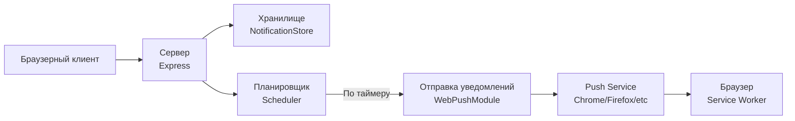

# Планировщик Web Push уведомлений

[Простой клиент](https://github.com/mvladt/webpush-dumb-client)

Простой планировщик Web Push-уведомлений на Nodejs.

Принимает от клиента [Push Subscription](https://developer.mozilla.org/en-US/docs/Web/API/PushSubscription), `datetime` (когда отправить) и `payload`. Кладёт это дело в хранилище. Извлекает уведомления по расписанию и отправляет в нужный момент.

## Возможности

- Приём и хранение уведомлений
- Планирование уведомлений на указанное время
- Автоматическая отправка уведомлений через Web Push Protocol

## Установка и запуск

1. `npm run setup`
2. Сгенерированные ключи в `.env`, по примеру `.env.example`
3. Установить VAPID*SUBJECT в `.env` в формате `mailto:<ваша*почта>` либо `https://<ваш_домен>`
4. Установить порт сервера в `.env` (опционально)
5. `npm run start`

## Описание API

### Эндпоинты

**GET** `/api/key` — Получение VAPID ключа. Он нужен для получения в браузере [PushSubscription](https://developer.mozilla.org/en-US/docs/Web/API/PushSubscription).

**POST** `/api/notifications` — Планирование уведомления. В теле запроса объект [NotificationEntity](https://github.com/mvladt/webpush-scheduler/blob/main/src/types.ts).

### Примеры запросов

```sh
curl -X GET 'https://scheduler.push.mvladt.ru/api/key'
```

```sh
curl -X POST 'https://scheduler.push.mvladt.ru/api/notifications' \
  -H 'Content-Type: application/json' \
  -d '{
    "id": "123",
    "datetime": "2025-11-09T00:23",
    "payload": {"text": "Hello"},
    "subscription": {
      "endpoint": "https://fcm.googleapis.com/fcm/send/...",
      "expirationTime": null,
      "keys": {
        "p256dh": "...",
        "auth": "..."
      }
    }
  }'
```

## Архитектура



---

_Это демонстрационный проект, показывающий полный цикл работы с Web Push Notifications._
