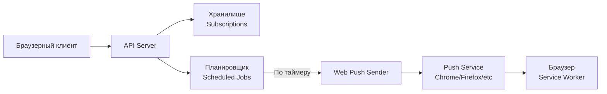

# Планировщик Web Push уведомлений

[Простой клиент](https://github.com/mvladt/webpush-dumb-client)

Серверная часть для планирования и отправки Web Push уведомлений. Принимает подписки и задания от клиента, хранит их и отправляет уведомления в запланированное время через Web Push Protocol.

## Возможности

- Приём и хранение уведомлений
- Планирование уведомлений на указанное время
- Автоматическая отправка уведомлений через Web Push Protocol

## Архитектура

