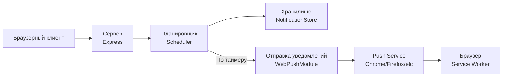

# Планировщик Web Push уведомлений


## Содержание

- [Возможности](#возможности)
- [Установка и запуск](#установка-и-запуск)
- [Описание API](#описание-api)
- [Хранилище](#хранилище)
- [Архитектура](#архитектура)
- [Деплой](#деплой)

[Простой клиент](https://github.com/mvladt/webpush-dumb-client)

Простой планировщик Web Push-уведомлений на Nodejs.

Принимает от клиента [Push Subscription](https://developer.mozilla.org/en-US/docs/Web/API/PushSubscription), `datetime` (_когда_ отправить) и `payload` (_что_ отправить). Кладёт всё это дело в хранилище. Извлекает уведомления по расписанию и отправляет _в нужный момент_.

## Возможности

- Приём и хранение уведомлений
- Планирование уведомлений на указанное время
- Автоматическая отправка уведомлений через Web Push Protocol

## Установка и запуск

Ограничение — версия Nodejs _не меньше_ «24.0».

1. `npm ci`
2. `npm start`

При первом запуске VAPID-ключи генерируются автоматически. Для кастомных значений (`VAPID_SUBJECT`, `PORT`) — отредактировать `.env` после первого запуска.

## Описание API

### Эндпоинты

**GET** `/api/key` — Получение VAPID ключа (публичного). Он нужен для получения [PushSubscription](https://developer.mozilla.org/en-US/docs/Web/API/PushSubscription) в браузере.

**POST** `/api/notifications` — Планирование уведомления. В теле запроса должен быть объект [NotificationEntity](https://github.com/mvladt/webpush-scheduler/blob/main/src/types.ts).

### Примеры запросов

```sh
curl -X GET 'https://scheduler.push.mvladt.ru/api/key'
```

```sh
curl -X POST 'https://scheduler.push.mvladt.ru/api/notifications' \
  -H 'Content-Type: application/json' \
  -d '{
    "id": "123",
    "datetime": "2025-11-09T00:23",
    "payload": {"text": "Hello"},
    "subscription": {
      "endpoint": "https://fcm.googleapis.com/fcm/send/...",
      "expirationTime": null,
      "keys": {
        "p256dh": "...",
        "auth": "..."
      }
    }
  }'
```

## Хранилище

Уведомления хранятся в SQLite — файл `notifications.db` в корне проекта (создаётся автоматически при первом запуске, в git не попадает).

- `payload` и `subscription` хранятся как JSON-строки.
- `datetime` нормализуется в канонический UTC-ISO (`new Date(...).toISOString()`), по нему построен индекс `idx_notifications_datetime` для быстрой выборки уведомлений «к отправке».
- Миграция старых данных из `notifications.json` автоматически не выполняется — при переходе на SQLite база стартует пустой, а старый JSON-файл остаётся нетронутым.

Посмотреть содержимое базы:

```sh
sqlite3 notifications.db 'SELECT id, datetime FROM notifications;'
```

## Архитектура


```mermaid
graph LR
    A[Браузерный клиент] --> B[Сервер<br>Express];
    B --> D[Планировщик<br>Scheduler];
    D --> C[Хранилище<br>NotificationStore];

    D -- По таймеру --> E[Отправка уведомлений<br>WebPushModule];
    E --> F[Push Service<br>Chrome/Firefox/etc];
    F --> G[Браузер<br>Service Worker];
```

## Деплой

Прод — `scheduler.push.mvladt.ru` (VPS, systemd). CI (`ci.yml`) гоняет тесты на каждый push/PR,
но деплой не автоматический: вкладка **Actions** → workflow **Deploy** → **Run workflow**
(`workflow_dispatch`). Деплой собирает зависимости, синкает артефакт по SSH в новый релиз,
переключает симлинк `current` и перезапускает сервис. Подробности — `deploy/README.md`.

---

_Это демонстрационный проект, показывающий полный цикл работы с Web Push Notifications._
